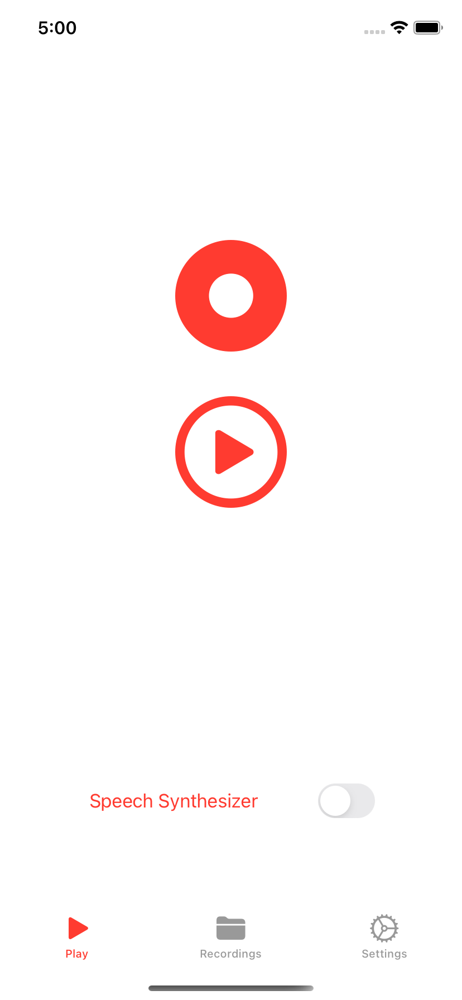
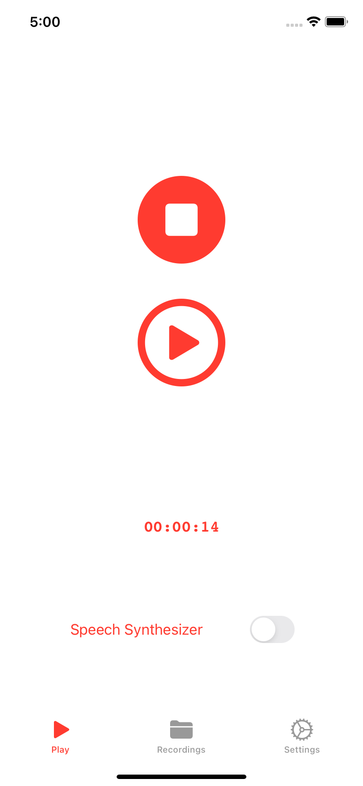
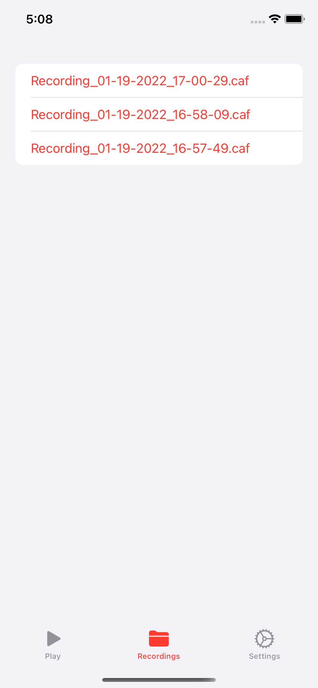
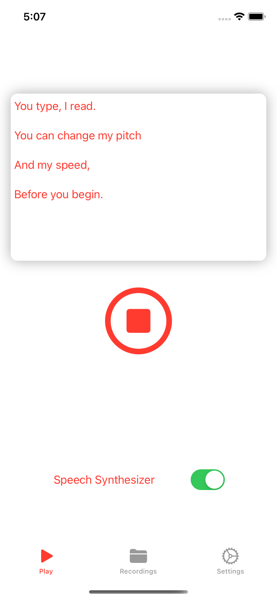
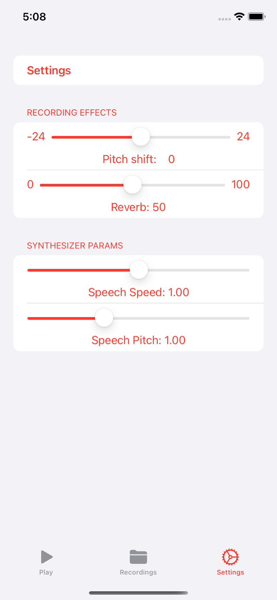

# Simple Audio Recorder + Speech Synthesizer

A simple audio recorder + speech synthesizer that utilizes essential functionalities of AVFoundation, and a little bit of AVAudioEngine for real-time audio effect processing.

Hacked in a day while learning more about AVFoundation. 

### Can: 

- Record 2 channel audio at 44100, linear PCM 
- Play back what just recorded immediately
- Toggle a text to speech player with an Australian accent
- Change the pitch and speed of the speech synthesizer in settings
- Change the pitch and reverb dry/wet of normal recordings in real-time during playback
- View and play recorded file in a separate tab

interface

recording

recorded files, tap to play

speech synthesizer

settings page

### Cannot:

- alter speech synth speed/pitch in real-time

### Future work (probably in a another project): 

- refactor the heck out
